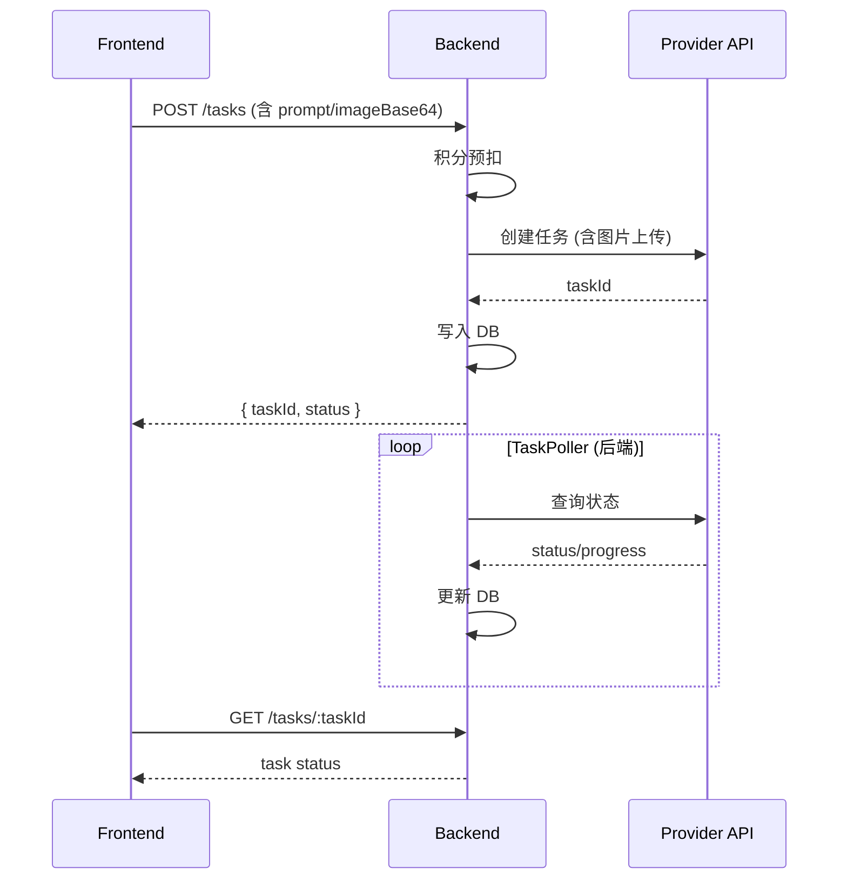
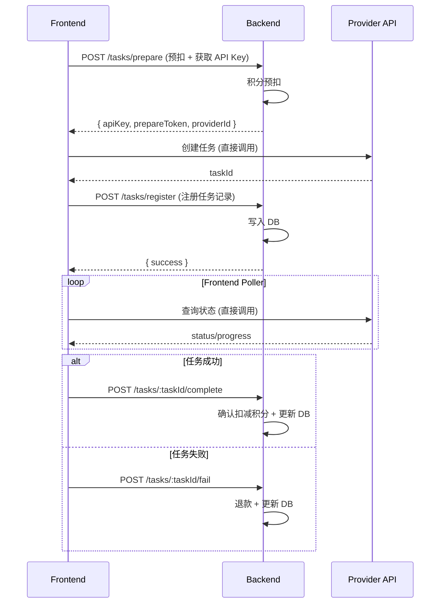

# 设计文档：前端直接调用第三方 API

## 概述

本设计将 3D 生成任务的 Provider API 调用从后端代理模式迁移到前端直接调用模式。核心变化：

- **前端**：直接调用 Provider API（创建任务、上传图片、轮询状态），新增 Provider 适配层
- **后端**：退出 API 代理角色，仅保留积分管理（预扣/确认/退款）、任务记录、API Key 分发和超时守护
- **渐进迁移**：通过配置开关同时支持新旧两种模式

### 设计目标

1. 大幅降低后端网络 I/O 和计算负担（图片上传中转、轮询等全部移至前端）
2. 积分管理仍由后端控制，确保计费准确性
3. API Key 安全分发，前端不持久化存储密钥
4. 支持多 Provider（Tripo3D、Hyper3D）的统一适配
5. 向后兼容，支持渐进式迁移

## 架构

### 当前架构（代理模式）



### 新架构（前端直调模式）



### 整体架构图

```mermaid
graph TB
    subgraph Frontend["前端 (Vue 3 SPA)"]
        UI[业务组件]
        PA[Provider 适配层]
        DP[Direct Poller]
        CB[Callback Client]
        KS[Key Store - 内存]
    end

    subgraph Backend["后端 (Express)"]
        PREP[/tasks/prepare]
        REG[/tasks/register]
        COMP[/tasks/:id/complete]
        FAIL[/tasks/:id/fail]
        CM[CreditManager]
        TG[超时守护]
        MODE[模式开关]
        OLD[旧代理路由]
    end

    subgraph Provider["Provider API"]
        TAPI[Tripo3D API]
        HAPI[Hyper3D API]
    end

    UI --> PA
    PA --> KS
    PA -->|直接调用| TAPI
    PA -->|直接调用| HAPI
    UI --> DP
    DP -->|直接轮询| TAPI
    DP -->|直接轮询| HAPI
    CB --> PREP
    CB --> REG
    CB --> COMP
    CB --> FAIL
    PREP --> CM
    COMP --> CM
    FAIL --> CM
    TG -->|超时退款| CM
    MODE -->|新模式| PREP
    MODE -->|旧模式| OLD
```

## 组件与接口

### 后端新增接口

#### 1. 任务预扣接口 `POST /tasks/prepare`

积分预扣 + API Key 分发，合并为一个原子操作。

```typescript
// 请求
interface PrepareRequest {
  type: 'text_to_model' | 'image_to_model';
  provider_id: string;
}

// 响应
interface PrepareResponse {
  apiKey: string;           // 解密后的 Provider API Key
  prepareToken: string;     // 预扣凭证（用于后续回调关联）
  providerId: string;
  estimatedPower: number;   // 预扣的 power 数量
  apiBaseUrl: string;       // Provider API 基础 URL
  modelVersion?: string;    // Provider 模型版本（如 Tripo 的 model_version）
  mode: 'direct' | 'proxy'; // 当前运行模式
}
```

流程：
1. 验证用户身份和权限（`auth` + `requirePermission('generate-model')`）
2. 验证 `provider_id` 是否启用
3. 读取账户快照，计算节流延迟
4. 执行积分预扣（复用现有 `creditManager.preDeduct`）
5. 解密 API Key
6. 生成 `prepareToken`（JWT，包含 userId、providerId、tempTaskId、过期时间）
7. 返回 API Key 和预扣凭证

安全措施：
- 响应头设置 `Cache-Control: no-store` 和 `Pragma: no-cache`
- API Key 不记录到日志

#### 2. 任务注册接口 `POST /tasks/register`

前端从 Provider 获取 taskId 后，通知后端创建任务记录。

```typescript
// 请求
interface RegisterRequest {
  prepareToken: string;     // 预扣凭证
  taskId: string;           // Provider 返回的任务 ID
  type: 'text_to_model' | 'image_to_model';
  prompt?: string;
  pollingKey?: string;      // Provider 轮询键（Hyper3D 使用 subscription_key）
}

// 响应
interface RegisterResponse {
  success: boolean;
}
```

流程：
1. 验证 `prepareToken`（JWT 验签 + 过期检查）
2. 从 token 中提取 userId、providerId、tempTaskId
3. 写入 tasks 表（status='queued'）
4. 更新 credit_ledger 中的 task_id（从 tempTaskId 更新为真实 taskId）

#### 3. 任务完成回调 `POST /tasks/:taskId/complete`

```typescript
// 请求
interface CompleteRequest {
  prepareToken: string;
  outputUrl: string;
  thumbnailUrl?: string;
  creditCost: number;       // Provider 返回的实际消耗
}

// 响应
interface CompleteResponse {
  success: boolean;
  billingStatus: 'settled' | 'undercharged';
  billingMessage?: string;
}
```

流程：
1. 验证 `prepareToken` 和任务所有权
2. 验证任务当前状态（防止重复回调）
3. 调用 `creditManager.finalizeTaskSuccess` 执行积分确认扣减
4. 更新任务状态为 `success`

#### 4. 任务失败回调 `POST /tasks/:taskId/fail`

```typescript
// 请求
interface FailRequest {
  prepareToken: string;
  errorMessage?: string;
}

// 响应
interface FailResponse {
  success: boolean;
}
```

流程：
1. 验证 `prepareToken` 和任务所有权
2. 调用 `creditManager.refund` 退还预扣积分
3. 更新任务状态为 `failed`

### 后端修改组件

#### 5. 超时守护机制

新增定时任务，扫描长时间未回调的预扣记录。

```typescript
// 超时守护配置
const PREPARE_TIMEOUT_MS = 15 * 60 * 1000; // 15 分钟
const GUARDIAN_INTERVAL_MS = 60 * 1000;     // 每分钟扫描一次
```

逻辑：
- 扫描 `credit_ledger` 中 `event_type='pre_deduct'` 且无对应 `confirm_deduct` 或 `refund` 记录的条目
- 如果 `created_at` 距今超过 15 分钟，自动执行退款
- 同时将对应 tasks 记录标记为 `timeout`

#### 6. 模式开关

通过 `system_config` 表中的 `api_mode` 配置项控制：

- `direct`：新模式，后端仅提供回调接口
- `proxy`：旧模式，保持当前代理行为

后端在 `POST /tasks/prepare` 响应中返回 `mode` 字段，前端据此决定调用方式。

### 前端新增组件

#### 7. Provider 适配器接口

```typescript
// frontend/src/adapters/IFrontendProviderAdapter.ts
interface CreateTaskInput {
  type: 'text_to_model' | 'image_to_model';
  prompt?: string;
  imageFile?: File;         // 前端直接使用 File 对象，不再 base64
}

interface CreateTaskOutput {
  taskId: string;
  pollingKey?: string;
  estimatedCreditCost: number;
}

interface TaskStatusOutput {
  status: 'queued' | 'processing' | 'success' | 'failed';
  progress: number;
  creditCost?: number;
  outputUrl?: string;
  thumbnailUrl?: string;
  errorMessage?: string;
}

interface IFrontendProviderAdapter {
  readonly providerId: string;
  createTask(apiKey: string, input: CreateTaskInput, apiBaseUrl: string): Promise<CreateTaskOutput>;
  getTaskStatus(apiKey: string, taskId: string, apiBaseUrl: string, pollingKey?: string): Promise<TaskStatusOutput>;
}
```

#### 8. Tripo3D 前端适配器

```typescript
// frontend/src/adapters/Tripo3DFrontendAdapter.ts
class Tripo3DFrontendAdapter implements IFrontendProviderAdapter {
  readonly providerId = 'tripo3d';

  async createTask(apiKey, input, apiBaseUrl): Promise<CreateTaskOutput> {
    // text_to_model: 直接 POST JSON
    // image_to_model: 先上传图片获取 file_token，再创建任务
  }

  async getTaskStatus(apiKey, taskId, apiBaseUrl): Promise<TaskStatusOutput> {
    // GET /task/{taskId}
  }
}
```

#### 9. Hyper3D 前端适配器

```typescript
// frontend/src/adapters/Hyper3DFrontendAdapter.ts
class Hyper3DFrontendAdapter implements IFrontendProviderAdapter {
  readonly providerId = 'hyper3d';

  async createTask(apiKey, input, apiBaseUrl): Promise<CreateTaskOutput> {
    // POST multipart/form-data 到 /rodin
  }

  async getTaskStatus(apiKey, taskId, apiBaseUrl, pollingKey): Promise<TaskStatusOutput> {
    // POST /status + POST /download
  }
}
```

#### 10. Provider 注册表

```typescript
// frontend/src/adapters/FrontendProviderRegistry.ts
class FrontendProviderRegistry {
  private adapters = new Map<string, IFrontendProviderAdapter>();
  register(adapter: IFrontendProviderAdapter): void;
  get(providerId: string): IFrontendProviderAdapter | undefined;
}
```

#### 11. 前端直调轮询器 `useDirectTaskPoller`

```typescript
// frontend/src/composables/useDirectTaskPoller.ts
function useDirectTaskPoller() {
  function startPolling(params: {
    taskId: string;
    pollingKey?: string;
    apiKey: string;
    providerId: string;
    apiBaseUrl: string;
    prepareToken: string;
    onUpdate: (status: TaskStatusOutput) => void;
    onComplete: () => void;
    onFail: (error: string) => void;
  }): void;

  function stopPolling(taskId: string): void;
  function stopAllPolling(): void;
}
```

特性：
- 每 3 秒轮询一次 Provider API
- 10 分钟超时自动停止
- 任务成功时调用 `POST /tasks/:taskId/complete`
- 任务失败时调用 `POST /tasks/:taskId/fail`
- 网络错误重试 3 次，间隔 2 秒
- 组件卸载时自动清理

#### 12. 前端任务创建流程 `useDirectTaskCreation`

```typescript
// frontend/src/composables/useDirectTaskCreation.ts
function useDirectTaskCreation() {
  async function createTask(params: {
    type: 'text_to_model' | 'image_to_model';
    prompt?: string;
    imageFile?: File;
    providerId: string;
  }): Promise<{ taskId: string }>;
}
```

流程：
1. 调用 `POST /tasks/prepare` 获取 apiKey 和 prepareToken
2. 检查返回的 `mode`，如果是 `proxy` 则回退到旧流程
3. 通过 Provider 适配器直接调用 Provider API 创建任务
4. 调用 `POST /tasks/register` 注册任务记录
5. 启动 `useDirectTaskPoller` 轮询
6. 如果任何步骤失败，调用 `POST /tasks/:taskId/fail` 退款

### 前端 API Key 安全管理

- API Key 仅存储在 composable 的闭包变量中（内存）
- 不写入 `localStorage`、`sessionStorage` 或任何持久化存储
- 任务流程结束后（成功/失败/超时），立即将变量置为 `null`
- `prepareToken` 同样仅存储在内存中


## 数据模型

### 现有表变更

#### tasks 表

无结构变更。新模式下的任务记录与旧模式使用相同的表结构，通过以下字段区分：

- `provider_status_key`：前端注册时传入的 pollingKey

#### credit_ledger 表

无结构变更。预扣流程与现有逻辑一致，仅 `task_id` 的更新时机从后端内部变为前端回调触发。

#### system_config 表

新增配置项：

| key | value | 说明 |
|-----|-------|------|
| `api_mode` | `direct` 或 `proxy` | 控制 API 调用模式 |
| `prepare_timeout_minutes` | `15` | 预扣超时时间（分钟） |

### PrepareToken（JWT）结构

```typescript
interface PrepareTokenPayload {
  userId: number;
  providerId: string;
  tempTaskId: string;       // 预扣时使用的临时任务 ID
  estimatedPower: number;   // 预扣的 power 数量
  iat: number;              // 签发时间
  exp: number;              // 过期时间（15 分钟）
}
```

使用后端已有的 `jsonwebtoken` 库签发和验证，密钥使用环境变量 `JWT_SECRET`（与现有 token 验证分开）。

### 前端状态模型

```typescript
// 任务创建过程中的临时状态
interface DirectTaskState {
  prepareToken: string | null;
  apiKey: string | null;        // 仅内存，不持久化
  providerId: string;
  apiBaseUrl: string;
  taskId: string | null;
  pollingKey: string | null;
  status: 'preparing' | 'creating' | 'polling' | 'completing' | 'done' | 'error';
}
```

### CORS 兼容性处理

| Provider | CORS 支持 | 处理方式 |
|----------|-----------|----------|
| Tripo3D | 待验证 | 如不支持，后端提供轻量代理 `POST /proxy/tripo3d/*` |
| Hyper3D | 待验证 | 如不支持，后端提供轻量代理 `POST /proxy/hyper3d/*` |

轻量代理与当前的全代理模式不同：
- 仅转发 HTTP 请求，不做业务逻辑处理
- 不执行积分管理
- 不写入任务记录
- 前端传入 API Key，后端仅做透传

```typescript
// 轻量代理路由（仅在 CORS 不支持时启用）
// POST /proxy/:providerId/*
// 请求头需包含 X-Provider-Api-Key
```

## 正确性属性

*属性是指在系统所有有效执行中都应成立的特征或行为——本质上是对系统应做什么的形式化陈述。属性是人类可读规范与机器可验证正确性保证之间的桥梁。*

### Property 1: 适配器请求构造完整性

*For any* 有效的 `CreateTaskInput`（包含有效的 prompt 字符串或有效的 image File），前端 Provider 适配器的 `createTask` 方法应构造出包含所有必要字段的请求体：对于 `text_to_model` 类型，请求体必须包含 `type` 和 `prompt`；对于 `image_to_model` 类型，请求体必须包含图片数据。返回的 `CreateTaskOutput` 必须包含非空的 `taskId`。

**Validates: Requirements 2.1, 2.2**

### Property 2: 超时守护退款完整性

*For any* `credit_ledger` 中 `event_type='pre_deduct'` 的记录，如果该记录的 `created_at` 距当前时间超过超时阈值（15 分钟），且不存在对应 `task_id` 的 `confirm_deduct` 或 `refund` 记录，则超时守护执行后，该 `task_id` 必须存在一条 `event_type='refund'` 的记录，且退款金额等于预扣金额的绝对值。

**Validates: Requirements 3.6, 7.3, 8.3**

### Property 3: 任务所有权验证

*For any* 任务 `T`（属于用户 `A`）和任意用户 `B`（`B ≠ A`），当用户 `B` 尝试调用 `complete` 或 `fail` 回调接口操作任务 `T` 时，后端应拒绝该请求并返回错误。

**Validates: Requirements 5.5**

### Property 4: PrepareToken 与任务匹配验证

*For any* `prepareToken`（包含 `userId` 和 `tempTaskId`）和任意 `taskId`，如果 `taskId` 对应的 `credit_ledger` 预扣记录中的 `task_id` 与 `prepareToken` 中的 `tempTaskId` 不匹配（即该 prepareToken 不是为该任务签发的），则 `complete` 和 `fail` 回调接口应拒绝该请求。

**Validates: Requirements 8.4**

## 错误处理

### 前端错误处理策略

| 错误场景 | 处理方式 |
|----------|----------|
| `POST /tasks/prepare` 失败 | 向用户展示错误信息，不调用 Provider API |
| `POST /tasks/prepare` 返回 `INSUFFICIENT_CREDITS` | 显示积分不足对话框 |
| `POST /tasks/prepare` 返回 `POOL_EXHAUSTED` | 显示节流提示，展示建议等待时间 |
| Provider API 创建任务失败 | 重试 3 次（间隔 2 秒），仍失败则调用 `POST /tasks/:taskId/fail` 退款 |
| Provider API 轮询失败 | 重试 3 次（间隔 2 秒），仍失败则调用 `POST /tasks/:taskId/fail` 退款 |
| `POST /tasks/register` 失败 | 调用 `POST /tasks/:taskId/fail` 退款（Provider 任务已创建但未记录） |
| `POST /tasks/:taskId/complete` 失败 | 重试 3 次，仍失败则记录到本地日志，依赖后端超时守护 |
| 轮询超时（10 分钟） | 停止轮询，调用后端超时回调 |
| 用户关闭浏览器 | 后端超时守护在 15 分钟后自动退款 |

### 后端错误处理策略

| 错误场景 | 处理方式 |
|----------|----------|
| `prepareToken` 验签失败 | 返回 401，拒绝请求 |
| `prepareToken` 已过期 | 返回 401，拒绝请求 |
| 任务不存在 | 返回 404 |
| 任务所有者不匹配 | 返回 403 |
| 重复回调（任务已完成） | 返回幂等成功响应（不重复扣减） |
| 预扣记录不存在 | 记录警告日志，返回 422 |
| 数据库错误 | 返回 500，事务回滚 |

### 错误码定义

```typescript
const ERROR_CODES = {
  INVALID_PREPARE_TOKEN: 'INVALID_PREPARE_TOKEN',   // prepareToken 无效
  PREPARE_TOKEN_EXPIRED: 'PREPARE_TOKEN_EXPIRED',   // prepareToken 已过期
  TASK_NOT_FOUND: 'TASK_NOT_FOUND',                 // 任务不存在
  TASK_OWNER_MISMATCH: 'TASK_OWNER_MISMATCH',       // 任务所有者不匹配
  TASK_ALREADY_COMPLETED: 'TASK_ALREADY_COMPLETED', // 任务已完成（幂等）
  TASK_ALREADY_FAILED: 'TASK_ALREADY_FAILED',       // 任务已失败（幂等）
  INSUFFICIENT_CREDITS: 'INSUFFICIENT_CREDITS',     // 积分不足
  POOL_EXHAUSTED: 'POOL_EXHAUSTED',                 // 池塘额度耗尽
  CONCURRENT_CONFLICT: 'CONCURRENT_CONFLICT',       // 并发冲突
  PROVIDER_NOT_CONFIGURED: 'PROVIDER_NOT_CONFIGURED', // Provider 未配置
  INVALID_PROVIDER: 'INVALID_PROVIDER',             // 无效 Provider
} as const;
```

## 测试策略

### 属性测试（Property-Based Testing）

使用 `fast-check` 库（后端和前端均已安装）。每个属性测试运行至少 100 次迭代。

| 属性 | 测试文件 | 说明 |
|------|----------|------|
| Property 1: 适配器请求构造 | `frontend/src/adapters/__tests__/adapter.property.test.ts` | 生成随机 prompt 和 File，验证适配器输出 |
| Property 2: 超时守护退款 | `backend/src/__tests__/timeoutGuardian.property.test.ts` | 生成随机预扣记录和时间戳，验证守护逻辑 |
| Property 3: 任务所有权 | `backend/src/__tests__/taskOwnership.property.test.ts` | 生成随机 userId/taskId 组合，验证所有权检查 |
| Property 4: Token 匹配 | `backend/src/__tests__/prepareToken.property.test.ts` | 生成随机 token/task 组合，验证匹配逻辑 |

每个测试需标注对应的设计属性：
- 标签格式：`Feature: frontend-direct-api, Property {number}: {property_text}`

### 单元测试

| 模块 | 测试重点 |
|------|----------|
| `PrepareController` | 预扣流程、API Key 返回、响应头安全、节流延迟 |
| `RegisterController` | Token 验签、任务记录创建、ledger task_id 更新 |
| `CompleteController` | 积分确认扣减、幂等处理、状态更新 |
| `FailController` | 退款执行、状态更新 |
| `TimeoutGuardian` | 超时扫描、自动退款 |
| `Tripo3DFrontendAdapter` | 请求构造、响应解析 |
| `Hyper3DFrontendAdapter` | 请求构造、响应解析 |
| `useDirectTaskPoller` | 轮询间隔、超时停止、回调触发 |
| `useDirectTaskCreation` | 完整流程、错误回退、模式切换 |

### 集成测试

| 场景 | 说明 |
|------|------|
| 完整任务流程（直调模式） | prepare → provider create → register → poll → complete |
| 任务失败流程 | prepare → provider create → poll → fail → refund |
| 超时退款流程 | prepare → 无回调 → guardian 自动退款 |
| 模式切换 | 验证 proxy/direct 模式切换正确 |
| 旧任务兼容 | 旧模式任务继续由 TaskPoller 处理 |
