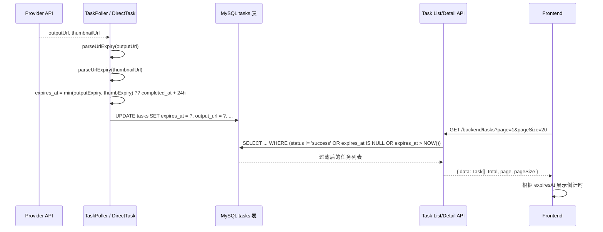

# 设计文档：任务过期时间持久化与分页

## 概述

本功能对现有任务管理系统进行三项增强：

1. **过期时间持久化**：将任务输出 URL 的过期时间从运行时动态解析改为写入数据库 `expires_at` 字段，使过期判断可在 SQL 层完成
2. **列表过滤**：任务列表接口自动排除已过期的成功任务，保留进行中/失败/超时任务及历史兼容数据
3. **前端倒计时**：前端根据 `expiresAt` 字段展示剩余有效时间，临近过期时以醒目样式提醒用户

现有的 `isDownloadExpired()` 运行时判断逻辑保持不变（用于下载接口的实时校验），`expires_at` 字段作为列表过滤和前端展示的数据源。

### 设计目标

1. 列表查询不再需要逐条解析 URL 签名，过期过滤在 SQL 层完成
2. 前端可直接使用 `expiresAt` 字段展示倒计时，无需额外计算
3. 兼容历史数据（`expires_at` 为 NULL 的任务正常展示）
4. 分页参数规范化，防止异常输入

## 架构

### 数据流



### 影响范围

| 层级 | 文件 | 变更类型 |
|------|------|----------|
| 数据库 | `migrate_task_expires_at.sql` | 新增迁移脚本 |
| 后端 | `backend/src/services/taskPoller.ts` | 修改 `handleSuccess` 计算并写入 `expires_at` |
| 后端 | `backend/src/controllers/directTask.ts` | 修改 `completeTask` 计算并写入 `expires_at` |
| 后端 | `backend/src/controllers/task.ts` | 修改 `listTasks` 添加过期过滤和分页元数据；修改 `getTask` 返回 `expiresAt` |
| 后端 | `backend/src/utils/urlExpiry.ts` | 新增 `computeExpiresAt` 工具函数 |
| 前端 | `frontend/src/api/index.ts` | `Task` 接口新增 `expiresAt` 字段；`listTasks` 支持分页参数 |
| 前端 | `frontend/src/views/GeneratorView.vue` | 展示倒计时、分页控件 |

## 组件与接口

### 1. 过期时间计算工具函数

在 `backend/src/utils/urlExpiry.ts` 中新增：

```typescript
/**
 * 根据 outputUrl 和 thumbnailUrl 计算 expires_at。
 * 取两者中较早的过期时间；解析失败时回退到 completedAt + 24h。
 */
export function computeExpiresAt(
  outputUrl: string | null,
  thumbnailUrl: string | null,
  completedAt: Date
): Date {
  const FALLBACK_MS = 24 * 60 * 60 * 1000;
  const fallback = new Date(completedAt.getTime() + FALLBACK_MS);

  const outputExpiry = outputUrl ? parseUrlExpiry(outputUrl) : null;
  const thumbExpiry = thumbnailUrl ? parseUrlExpiry(thumbnailUrl) : null;

  const candidates: number[] = [];
  if (outputExpiry !== null) candidates.push(outputExpiry);
  if (thumbExpiry !== null) candidates.push(thumbExpiry);

  if (candidates.length === 0) return fallback;
  return new Date(Math.min(...candidates));
}
```

### 2. TaskPoller 修改

在 `handleSuccess` 函数中，任务成功写入 DB 时同时计算并存储 `expires_at`：

```typescript
// 在 handleSuccess 中，UPDATE tasks 语句增加 expires_at 字段
const expiresAt = computeExpiresAt(outputUrl, thumbnailUrl ?? null, new Date());

// SQL: UPDATE tasks SET ..., expires_at = ? WHERE task_id = ?
```

### 3. DirectTask 回调修改

在 `controllers/directTask.ts` 的 `completeTask` 中，同样计算 `expires_at`：

```typescript
const expiresAt = computeExpiresAt(outputUrl, thumbnailUrl ?? null, new Date());
// 传入 creditManager.finalizeTaskSuccess 或在其后单独 UPDATE
```

### 4. 任务列表接口修改

`GET /backend/tasks` 查询条件变更：

```sql
SELECT ... FROM tasks
WHERE user_id = ?
  AND (
    status != 'success'
    OR expires_at IS NULL
    OR expires_at > NOW()
  )
ORDER BY created_at DESC
LIMIT ? OFFSET ?
```

响应格式保持现有结构，新增 `expiresAt` 字段：

```typescript
interface TaskListResponse {
  data: Array<{
    taskId: string;
    // ... 现有字段 ...
    expiresAt: string | null;  // ISO 8601 格式，如 "2025-01-15T12:00:00.000Z"
  }>;
  total: number;
  page: number;
  pageSize: number;
}
```

### 5. 任务详情接口修改

`GET /backend/tasks/:taskId` 响应新增 `expiresAt` 字段，格式同上。

### 6. 前端 API 类型更新

```typescript
// frontend/src/api/index.ts
export interface Task {
  // ... 现有字段 ...
  expiresAt: string | null;  // 新增
}

// listTasks 支持分页参数
export const listTasks = (params?: { page?: number; pageSize?: number }) =>
  backendApi.get<{ data: Task[]; total: number; page: number; pageSize: number }>(
    '/tasks',
    { params }
  );
```

### 7. 前端倒计时展示

新增工具函数 `formatExpiryCountdown`：

```typescript
/**
 * 将 expiresAt 转换为倒计时文本。
 * 返回 null 表示不展示倒计时（已过期或无数据）。
 */
export function formatExpiryCountdown(expiresAt: string | null): {
  text: string;
  urgent: boolean;
} | null {
  if (!expiresAt) return null;
  const remaining = new Date(expiresAt).getTime() - Date.now();
  if (remaining <= 0) return null;

  const hours = Math.floor(remaining / 3600000);
  const minutes = Math.floor((remaining % 3600000) / 60000);
  const urgent = remaining < 3600000; // < 1 小时

  return {
    text: hours > 0 ? `剩余 ${hours}小时${minutes}分` : `剩余 ${minutes}分`,
    urgent,
  };
}
```

### 8. 前端分页控件

在 `GeneratorView.vue` 任务列表底部添加 `el-pagination` 组件：

```vue
<el-pagination
  v-if="total > pageSize"
  v-model:current-page="currentPage"
  :page-size="pageSize"
  :total="total"
  layout="prev, pager, next"
  @current-change="handlePageChange"
/>
```

## 数据模型

### tasks 表变更

```sql
ALTER TABLE tasks
  ADD COLUMN expires_at DATETIME NULL COMMENT '任务输出 URL 过期时间（UTC）' AFTER completed_at;

CREATE INDEX idx_expires_at ON tasks (expires_at);
```

- `expires_at` 为 NULL 表示历史数据或未完成任务
- 已完成任务的 `expires_at` 由 `computeExpiresAt` 在任务成功时计算写入
- 索引用于列表查询的过期过滤

### 分页参数规范化

| 参数 | 类型 | 默认值 | 约束 |
|------|------|--------|------|
| `page` | number | 1 | `Math.max(1, page)` |
| `pageSize` | number | 20 | `Math.min(50, Math.max(1, pageSize))` |

现有 `listTasks` 控制器已实现此逻辑，无需变更。

## 正确性属性

*属性是指在系统所有有效执行中都应成立的特征或行为——本质上是对系统应做什么的形式化陈述。属性是人类可读规范与机器可验证正确性保证之间的桥梁。*

### Property 1: 过期时间计算正确性

*For any* 有效的 `outputUrl` 和可选的 `thumbnailUrl`，`computeExpiresAt` 返回的时间应等于两个 URL 中可解析过期时间的较小值；若两个 URL 均无法解析过期时间，则返回 `completedAt + 24小时`。

**Validates: Requirements 1.2, 1.3, 1.4**

### Property 2: 列表过期过滤正确性

*For any* 任务集合，列表接口返回的结果应恰好包含：所有非 `success` 状态的任务，加上 `expires_at` 为 NULL 的 `success` 任务，加上 `expires_at` 晚于当前时间的 `success` 任务。已过期的 `success` 任务（`expires_at` 不为 NULL 且早于当前时间）不应出现在结果中。

**Validates: Requirements 2.1, 2.2, 2.3**

### Property 3: 响应序列化完整性

*For any* 任务记录，列表接口和详情接口返回的 JSON 中 `expiresAt` 字段应为 ISO 8601 格式的时间字符串（当 `expires_at` 不为 NULL 时）或 `null`（当 `expires_at` 为 NULL 时），且该值与数据库中的 `expires_at` 一致。

**Validates: Requirements 3.1, 3.2**

### Property 4: 分页参数规范化

*For any* 整数 `page` 和 `pageSize`，列表接口的有效 `page` 应为 `max(1, page)`，有效 `pageSize` 应为 `min(50, max(1, pageSize))`。返回的 `data` 数组长度不超过有效 `pageSize`，`total` 反映过滤后的总条数，`page` 和 `pageSize` 反映实际使用的值。

**Validates: Requirements 4.1, 4.2, 4.3, 4.4**

### Property 5: 倒计时格式化正确性

*For any* 未来时间戳 `expiresAt`，`formatExpiryCountdown` 应返回包含正确小时和分钟数的倒计时文本，且当剩余时间小于 1 小时时 `urgent` 为 `true`，否则为 `false`。对于 `null` 或已过去的时间戳，应返回 `null`。

**Validates: Requirements 3.3, 3.4, 3.5**

### Property 6: 列表排序正确性

*For any* 任务列表响应，`data` 数组中的任务应按 `createdAt` 严格降序排列。

**Validates: Requirements 5.3**

## 错误处理

| 场景 | 处理方式 |
|------|----------|
| `parseUrlExpiry` 解析失败 | 回退到 `completedAt + 24h`，不抛异常 |
| `computeExpiresAt` 中 `completedAt` 为 null | 使用当前时间作为基准 |
| 分页参数非数字 | `parseInt` 后 `NaN` 被 `Math.max/min` 修正为默认值 |
| 前端 `expiresAt` 格式异常 | `formatExpiryCountdown` 返回 `null`，不展示倒计时 |
| 迁移脚本执行失败 | 标准 SQL 错误处理，不影响现有功能（字段为 NULL 兼容） |

## 测试策略

### 属性测试（Property-Based Testing）

使用 `fast-check` 库（后端和前端均已安装）。每个属性测试运行至少 100 次迭代。

| 属性 | 测试文件 | 说明 |
|------|----------|------|
| Property 1: 过期时间计算 | `backend/src/__tests__/computeExpiresAt.property.test.ts` | 生成随机签名 URL 对，验证 `computeExpiresAt` 输出 |
| Property 2: 列表过期过滤 | `backend/src/__tests__/taskListFilter.property.test.ts` | 生成随机任务集合，验证过滤逻辑 |
| Property 3: 响应序列化 | `backend/src/__tests__/taskResponseSerialization.property.test.ts` | 生成随机任务记录，验证 `expiresAt` 序列化 |
| Property 4: 分页参数规范化 | `backend/src/__tests__/taskPagination.property.test.ts` | 生成随机 page/pageSize，验证规范化逻辑 |
| Property 5: 倒计时格式化 | `frontend/src/views/__tests__/expiryCountdown.property.test.ts` | 生成随机时间戳，验证格式化输出 |
| Property 6: 列表排序 | `backend/src/__tests__/taskListFilter.property.test.ts` | 与 Property 2 合并，验证排序 |

每个测试需标注对应的设计属性：
- 标签格式：`Feature: task-expiry-pagination, Property {number}: {property_text}`

### 单元测试

| 模块 | 测试重点 |
|------|----------|
| `computeExpiresAt` | 各种 URL 格式组合、fallback 逻辑、边界情况 |
| `listTasks` 控制器 | 过期过滤 SQL 条件、分页参数处理、响应格式 |
| `getTask` 控制器 | `expiresAt` 字段返回、所有权验证 |
| `formatExpiryCountdown` | null 输入、已过期、临近过期、正常倒计时 |
| 分页控件 | 显示/隐藏逻辑、页码切换 |

### 集成测试

| 场景 | 说明 |
|------|------|
| 任务成功完成 | 验证 `expires_at` 被正确写入 DB |
| 列表过滤 | 创建多个不同状态/过期时间的任务，验证列表返回正确 |
| 分页 | 创建超过一页的任务，验证分页参数和返回数据 |
| 历史数据兼容 | `expires_at` 为 NULL 的任务正常出现在列表中 |
